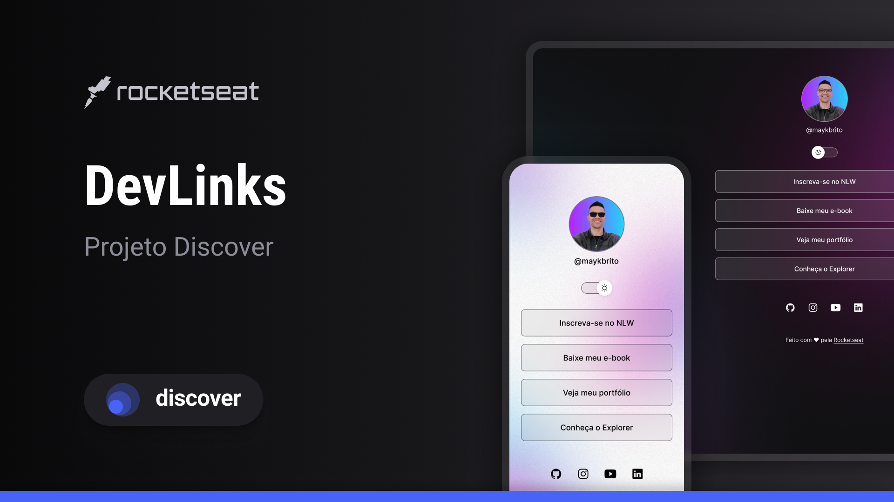

# DEV LINKS

## Projeto

DevLinks é um agregador de links para usar como cartão de visitas online.

[Clique aqui para acessar](https://nerfandao.github.io/projeto-nlw_eSports/)

## Layout

Você pode visualizar o layout do projeto através desse [Link](https://figma.com/design/frKPtxNRsxQTYfFBcuPVE6/37a9db62-47f5-402b-b2c4-5036639f3742?node-id=0-1&t=kr47vYbqVIMchk9F-1/). É necessário ter conta no [Figma](https://figma.com) para acessá-lo.

## Tecnologias

Esse projeto foi desenvolvido com as seguintes tecnologias:

- HTML e CSS
- Javascript
- Git e Github
- Figma

## Licença

Esse projeto está sob a licença MIT.
